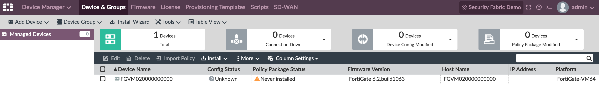
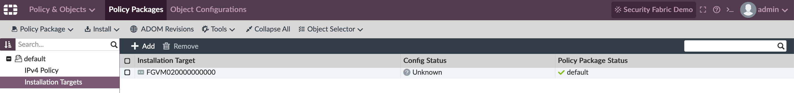
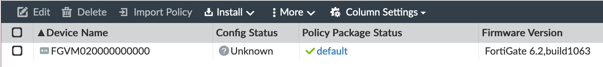

.. getting_started_fortios:

Getting Started - FortiManager
########################################################################

In this article we will cover how to add a model device and install a
policy package on FortiManager using Ansible.

.. contents::

Overview
************************************************************************

In this article, quite similar to the previous (Getting started with
Ansible and FortiGate Automation) where we covered how to use Ansible
with FortiOS we will also use a docker container to run the control
node, if you followed the first article you can even use the same
container but this time we will improve upon the manual tasks to create
the container and leverage some useful features of docker to automate
that process, specifically by defining the image and which packages to
install using a Dockerfile and define mount points with a docker-compose
file. 

After we have an automated container build we will explore how to
interact with the FortiManager modules, create a new model device,
associate a policy package and install it.

Versions & Source
************************************************************************

.. list-table::
   :header-rows: 1

   * - Software
     - Version
   * - FortiManager-VM 
     - 6.2.3
   * - Ansible
     - 2.9.11
   * - Python
     - 3.7.5
   * - fortinet.fortimanager collection
     - 1.0.3

`Last updated: 2020-08-12`

- `Source <https://github.com/mbdraks/automating-ftnt-securityfabric/tree/master/code/getting_started_fortimanager>`_

Recipe
************************************************************************

1. Define a Dockerfile and docker-compose.yml files
========================================================================

Dockerfile is a file with instructions for building the base image used
on your containers, so instead of pulling a base image, starting a
container with it and manually installing packages we will define which
packages we need in this file.

.. literalinclude:: ../code/getting_started_fortimanager/Dockerfile
   :language: Dockerfile
   :caption: Dockerfile

In this Dockerfile we defined :

- Base Image is ubuntu:19.10
- Installation of python3, Ansible and dependencies
- Installation of Ansible galaxy module fortinet.fortimanager
- Finally, the working directory will be /ansible/playbooks

Now create a new file named docker-compose.yml, this will contain the
container definitions that we usually pass a command line arguments,
having it defined on the docker-compose file will guarantee that we
don't forget to pass any relevant arguments to the container.

.. literalinclude:: ../code/getting_started_fortimanager/docker-compose.yml
   :language: YAML
   :caption: docker-compose.yml

In this docker-compose YAML file we defined:

- To start the container using a build definition (Dockerfile) that is
  on the same folder as the docker-compose file

- Name that build image as `ansible:1.0`

- Mount the local folder `./ansible` to the container folder `/ansible`.
  This will come in handy as we edit files locally on our device and those
  files are transparently available to the container.

After you have those two files created execute the following command:

.. code-block:: console

    $ docker-compose run ansible bash
    Building ansible
    Step 1/3 : FROM ubuntu:19.10
    19.10: Pulling from library/ubuntu

    ...

    Successfully built 3e3ad52d93fe
    Successfully tagged ansible:1.0
    WARNING: Image for service ansible was built because it did not 
    already exist. To rebuild this image you must use 
    `docker-compose build` or `docker-compose up --build`.
    root@69bdab627c69:/ansible#

This will trigger the base image download, custom image creation (with
the packages defined on Dockerfile, this image will be named using the
convention of repository:tag so if you list your images it will appear
as ansible:1.0) and will spin up a new container mounting the folder as
instructed on docker-compose.yml

After the build process is finished you should be at the container
shell, you can verify that the fortinet.fortimanager Ansible module was
correctly installed by checking the documentation:

.. code-block:: console
    
   $ ansible-doc fortinet.fortimanager.fmgr_dvm_cmd_add_device

2. Create an inventory and playbook file for adding a new model device
========================================================================

The inventory file now will be slightly different from our previous one,
we will optimize it a little and put common variables directly on the
inventory so we don't have to repeat them on all playbooks. This is a
common principle called DRY.

.. literalinclude:: ../code/getting_started_fortimanager/ansible/inventory.ini
   :language: INI
   :caption: inventory.ini

We will also define a minimal ansible.cfg file, this will allow us to
run our playbooks without specifying the inventory file on the command
line:

.. literalinclude:: ../code/getting_started_fortimanager/ansible/ansible.cfg
   :language: INI
   :caption: ansible.cfg

Finally let's dig into the playbook itself. 

My first tip is that during the playbook creation you need to pay
attention to indentation, I used a online YAML to JSON converter to make
sure my spaces were correctly aligned which sometimes is not obvious
from a visual inspection.

Here's the playbook, create it on a new /ansible/playbook subfolder:

.. literalinclude:: ../code/getting_started_fortimanager/ansible/playbooks/01_add_model_device.yml
   :language: YAML
   :linenos:
   :caption: 01_add_model_device.yml

Line 1 is just a comment which in this case is the same as the filename,
line 2 is a YAML directive that states the start of the document.

Lines 3-8 should be familiar, except line 5. Disabling the gather_facts
is useful to speed up the playbook execution.

This task is to add a new device model (a template of a device, this is
useful for `Zero Touch
Provisioning <https://docs.fortinet.com/document/fortigate/6.2.0/cookbook/861490/zero-touch-provisioning-with-fortimanager>`_
use cases), we can read the `module
documentation <https://ansible-galaxy-fortimanager-docs.readthedocs.io/en/galaxy-1.0.3/docgen/fmgr_dvm_cmd_add_device.html>`_
and based on those parameters we create the playbook.

Line 13 is required because we're not bypassing the module constraints
for os_ver and mr (OS Version and Major Release). All other lines are
relevant to the action we're executing, adding a new device model with
SN FGVM020000000000, FortiOS Version 6.2 on the FMG ADOM root.

This is the file/dir structure so far:

.. code-block:: bash

    .
    ├── Dockerfile
    ├── ansible
    │   ├── ansible.cfg
    │   ├── inventory.ini
    │   └── playbooks
    │       └── 01_add_model_device.yml
    └── docker-compose.yml

    2 directories, 5 files

At this point you're ready to run your first playbook against FortiManager:

.. code-block:: console

    root@c02f4307c0d2:/ansible# ansible-playbook playbooks/01_add_model_device.yml 

    PLAY [Add model device to FMG and install Policy Package] ********************************************************

    TASK [Add model device] ******************************************************************************************
    changed: [fmg01]

    PLAY RECAP *******************************************************************************************************
    fmg01                      : ok=1    changed=1    unreachable=0    failed=0    skipped=0    rescued=0    ignored=0

If you inspect your FMG at this point you should see a new managed device. Yay!

But it's not sufficient to only have the device without being able to
associate and install policies on it right? So let's create a new
playbook to execute those tasks.

3. Associate and install a Policy Package to a device
========================================================================

.. literalinclude:: ../code/getting_started_fortimanager/ansible/playbooks/02_install_policy_package_to_device.yml
   :language: YAML
   :linenos:
   :caption: 02_install_policy_package_to_device.yml

Notice that each task has it's specific module, understand the API
structure of FMG will make your job easier when you're trying to figure
it out which module correspond to which task. Another details that may
have captured your attention is that we're repeating ourselves a lot. We
will optimize that in a bit, before that let's run this playbook and see
the results.

.. code-block:: console

    root@c02f4307c0d2:/ansible# ansible-playbook playbooks/02_install_policy_package_to_device.yml 

    PLAY [Add model device to FMG and install Policy Package] ********************************************************

    TASK [Add policy package to model device] ************************************************************************
    changed: [fmg01]

    TASK [Install policy package to model device] ********************************************************************
    changed: [fmg01]

    PLAY RECAP *******************************************************************************************************
    fmg01                      : ok=2    changed=2    unreachable=0    failed=0    skipped=0    rescued=0    ignored=0

Policy Package ``default`` associated to device model.

Policy Package correctly installed on device.

4. Refactor the playbooks
========================================================================

Finally we have a working set of files that achieve our initial goal:
Add a new model device and install a policy package on it, however if we
need to add another device we would have to change those files on
several places so let's optimize that code by using some variables and
isolating those variables to it's own file, this way anytime we need to
add a new device model we only need to change the variables, not the
task itself.

Create this new file:

.. literalinclude:: ../code/getting_started_fortimanager/ansible/playbooks/03_add_model_dev_with_PP_and_vars.yml
   :language: YAML
   :linenos:
   :caption: 03_add_model_dev_with_PP_and_vars.yml

In this new file we are consolidating the add device and install policy
package steps, notice the syntax for using variables: ``'{{ variable_name
}}'`` and on lines 9-10 where we import the variables file.

Create the variables file:

.. literalinclude:: ../code/getting_started_fortimanager/ansible/playbooks/03_variables.yml
   :language: YAML
   :linenos:
   :caption: 03_variables.yml

Delete the existing device on FMG and run the new playbook:

.. code-block:: console

    root@c02f4307c0d2:/ansible# ansible-playbook playbooks/03_add_model_dev_with_PP_and_vars.yml 

    PLAY [Add model device to FMG and install Policy Package - Optimized with vars] **********************************

    TASK [Add model device] ******************************************************************************************
    changed: [fmg01]

    TASK [Add policy package to model device] ************************************************************************
    changed: [fmg01]

    TASK [Install policy package to model device] ********************************************************************
    changed: [fmg01]

    PLAY RECAP *******************************************************************************************************
    fmg01                      : ok=3    changed=3    unreachable=0    failed=0    skipped=0    rescued=0    ignored=0

And the final result on FMG:

Feel free to explore other FortiManager modules, you just created an
automated build process for the ansible control node and optimized
ansible config, inventory and playbooks for interacting with
FortiManager.

References
************************************************************************

- `Dockerfile <https://docs.docker.com/engine/reference/builder/>`_
- `Docker Compose <https://docs.docker.com/compose/gettingstarted/>`_
